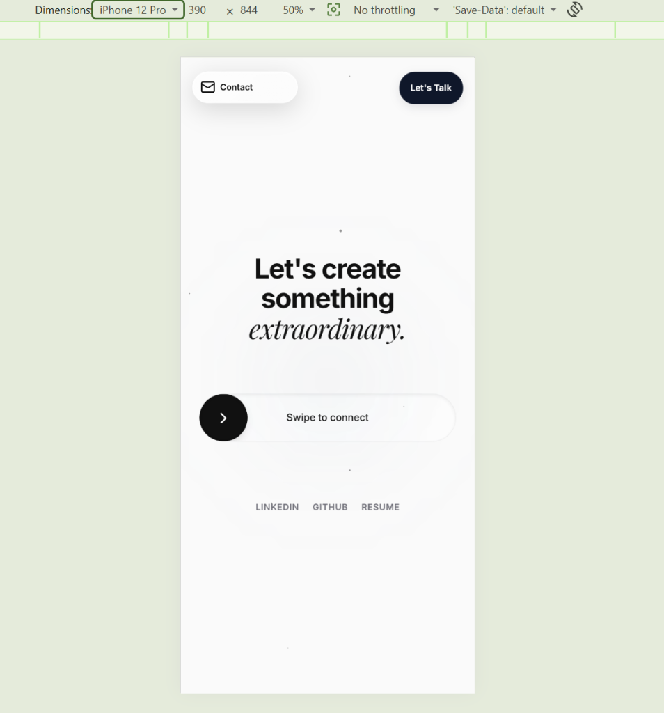

# Karthik's Portfolio (Apple-Inspired)



A high-performance, meticulously crafted personal portfolio designed to showcase top-tier frontend engineering skills. Built with an Apple-inspired aesthetic, this portfolio features complex layout systems, hardware-accelerated animations, and zero-lag mobile responsiveness.

🌐 **[Live Production Deployment](https://karthik-portfolio.vercel.app)**

## 🚀 Key Features

- **Apple-Inspired Glassmorphism:** Deeply integrated frosted glass effects (`backdrop-filter`) and dynamic island navigation paradigms.
- **Magnetic Dock Navigation:** A custom-engineered, frictionless drag-to-select navigation system built from scratch with absolute coordinate math for zero-lag 60fps tracking.
- **Hardware-Accelerated Animations:** Smooth page transitions, text reveals, and micro-interactions powered by GSAP and Framer Motion.
- **3D Canvas Rendering:** Subtle, high-performance particle and star field backgrounds using React Three Fiber.
- **Mobile-First UX:** Complex touch event handling (`touchmove` interception, long-press gesture detection, custom swipe-to-confirm sliders) ensuring native-app-like feel on iOS and Android.

## 🛠 Tech Stack

- **Framework:** React 19 (via Vite)
- **Styling:** Vanilla CSS (CSS Variables, Flexbox/Grid, custom keyframes)
- **Animation:** GSAP (ScrollTrigger), Framer Motion, Motion
- **3D Graphics:** React Three Fiber, Three.js
- **Icons:** Lucide React
- **Deployment:** Vercel

## 💻 Local Development Setup

To run this project locally, follow these steps:

1. **Clone the repository:**
   ```bash
   git clone https://github.com/karthik26-hub-lab/karthik-personal-portfolio.git
   cd karthik-personal-portfolio
   ```

2. **Install dependencies:**
   ```bash
   npm install
   ```

3. **Start the development server:**
   ```bash
   npm run dev
   ```

4. **Open in browser:**
   Navigate to `http://localhost:5173/`

## 🏗 Architecture Highlights

- **`SwipeButton.jsx`**: A highly interactive, zero-latency swipe-to-confirm button for contact interactions, utilizing custom pointer capture and haptic feedback (`navigator.vibrate`).
- **`Navbar.jsx`**: Features two distinct physics engines. A strict magnetic drag engine for desktop, and a specialized long-press context menu engine for mobile devices with Safari rubber-banding overrides.
- **Performance Profiling**: Rendering of `box-shadow` heavy layers (`StarsBackground`) are actively throttled based on device capability/viewport size to guarantee 60fps scrolling.

## 📄 License

This project is open-source and available under the MIT License.
